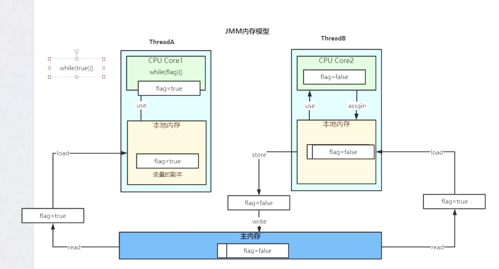
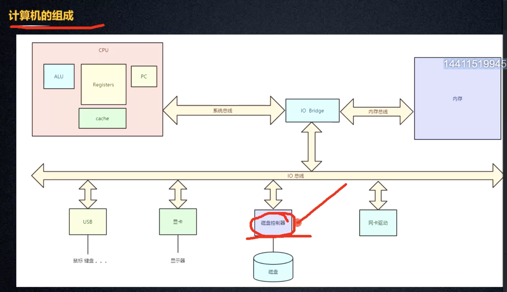
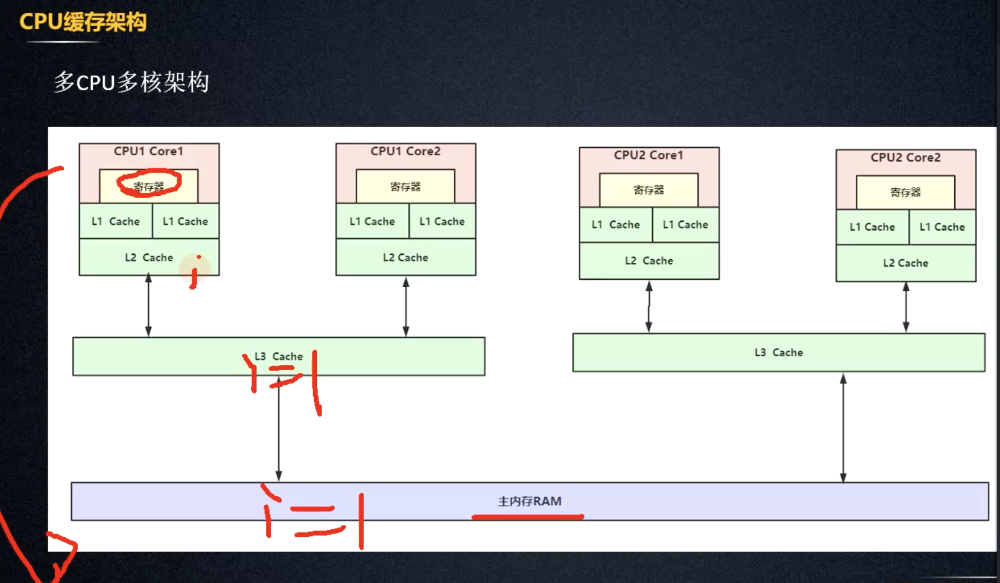
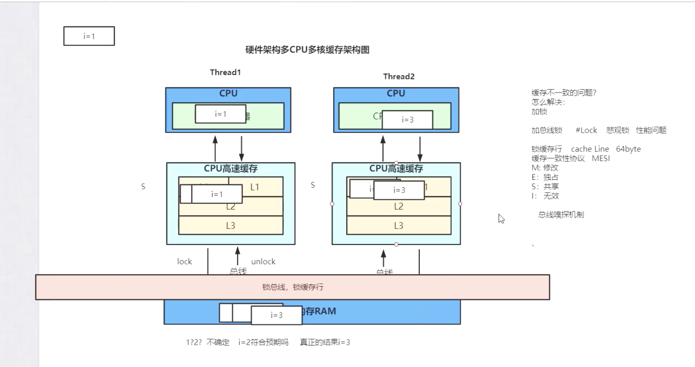
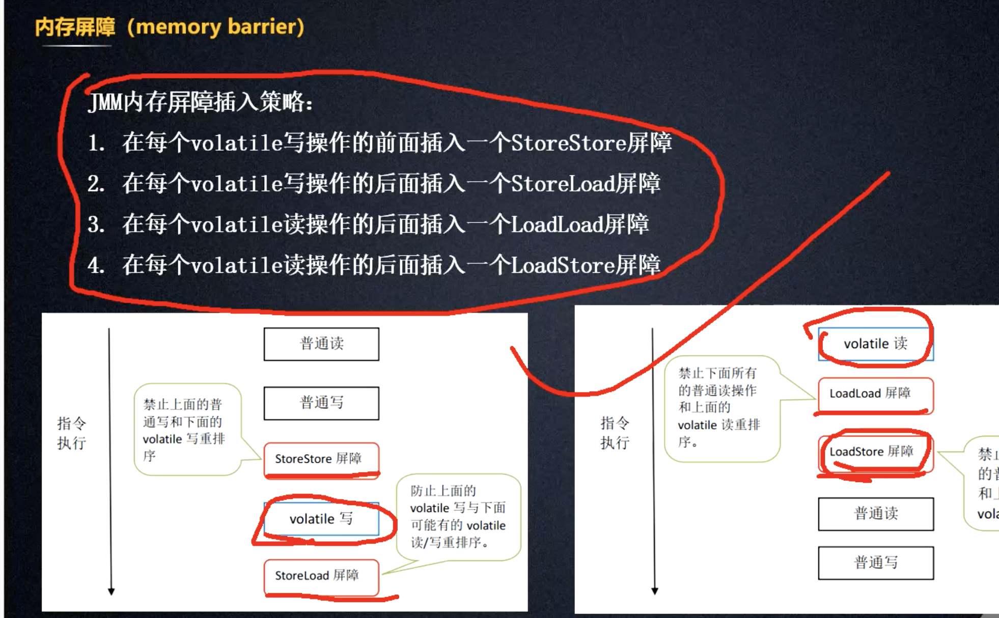
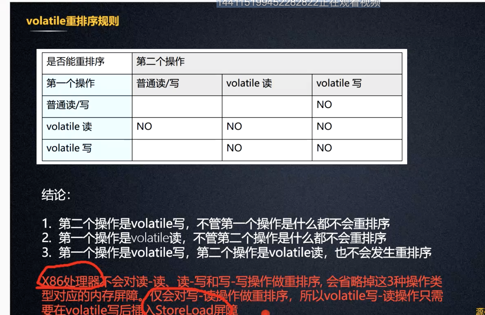
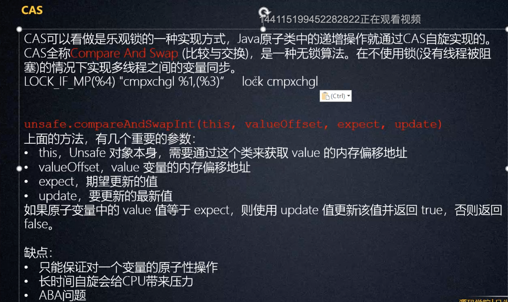
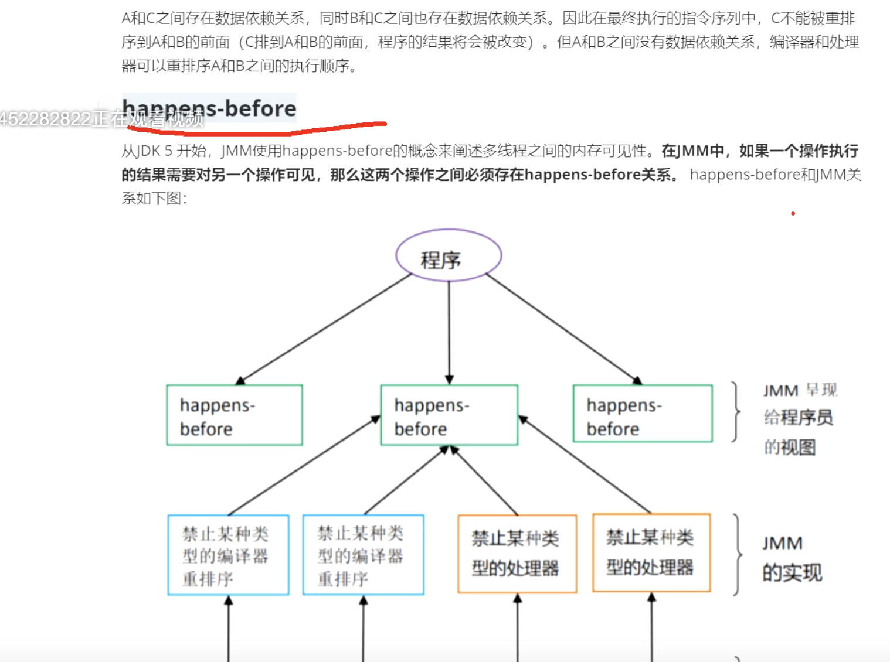
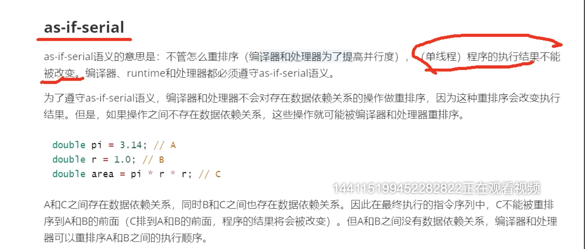

###并发的本质是解决什么样的问题
* 1.并发的本质就解决
```
多线程并发主要从三个地方着手，
1分工（任务拆解）
2同步(线程间的协作)
3互斥（独占）
```
* 2.并发怎么样学习
```
1.JMM模型又叫Java线程模型
```

```
2.cpu缓存架构
```




```
3.缓存一次性协议？
    解决方案 
    1.加锁 总线锁 影响性能  悲观锁
    2.缓存行 64byte 缓存一次性协议（MESI）  M修改  E 独占  s共享  i无效 通过总嗅探机制
    3.cache line的大小是64byte  如果多个核线程在操作同一个缓存行中的数据，那么就会出现频繁的缓存失效，
    即使在代码层面看这两个线程操作的数据之间完成没有关系。这种不合理的资源竞争就是伪共享
    避免缓存伪共享：缓存行填充 Java8 使用sun.misc.Contended
4.volatile 可见行，有序性   通过lock触发MESI缓存一致协议
Java对象是如何创建的
1开辟分配内存地址
2初始化对象
3指向内存地址
Java单线程的情况下会存在 jit即使编译器可能出现指令重排 汇编指令可能是132执行
多线程情况下就会出现问题  所以volatile必须禁止132这个重新排序的发生，也就是指令重排，保证Java代码的有序性
```



```
5.cas
```




* 3.并发的三个特性
```
并发的三个特性分别是原子性，可见性，有序性
```
* 4.锁机制
```
1. synchronized 内置锁
2. juc  AQS(独占锁 共享锁  读写锁)  同步器 队列 同步队列 条件队列
3. java 线程是重量级线程->cpu内核创建的，比如linux的pthread_read 这样会带来性能开销
  JavaThread -》 OsThread -》 nativeThread
4.线程池  线程复用（创建线程创建/销毁的开销）
5 并发的容器
6 并行
```
* 5.并发和并行区别
```
共同点：最大化cpu最大的使用率
并发：同一时刻只能有一个指令在执行。但是多线程指令呗快速轮询执行
并行：同一时刻多个指令在多个处理器上同时执行
```
* 6.线程上下文切换 采用时间片轮询 
```
cpu给每个任务服务一定的时间，保存状态，加载下一个任务状态，执行下一个任务
```
* 7并发编程的风险和缺点
```
1.高并发下频繁的切换上下文反而影响性能
2.活跃问题（一个并发应用程序能及时执行的能力），容易及时出现死锁，饥饿，活锁
死锁：两个线程互相阻塞，互相等待对方释放锁  jps 查看进程号 jstack 进程号 或者idea 照相机查看
饥饿：如果说一个线程因为时间处理器时间全部被其他线程抢走而得不到处理器的运行时间
活锁：一个线程通常会响应其他线程活动，其他线程也会响应另一个线程活动，有可能发生活锁  线程并没有阻塞，只是线程间在互相先让
3.线程安全，多个线程共享可能产生于期望值不同的结果
```
### synchronized原理（非公平锁）
```
线程八锁 看题
在static方法前加synchronizedstatic：静态方法属于类方法，它属于这个类，获取到的锁，是属于类的锁。
在普通方法前加synchronizedstatic：非static方法获取到的锁，是属于当前对象的锁。
wait  没有时间的等待 会释放时间片 但是可以释放锁资源
sleep  有时间的等待  会释放时间片 但是不可以释放锁资源

操作系统有monitor机制  每一个Java对象都有一个monitor机制
内置锁在Java中被抽象为监视器锁（monitor）。在JDK 1.6之前，
监视器锁可以认为直接对应底层操作系统中的互斥量（mutex）。
这种同步方式的成本非常高，包括系统调用引起的内核态与用户态切换、线程阻塞造成的线程切换等。
因此，后来称这种锁为“重量级锁”。
同步方法是由acc_synchronized标志来实现的，
同步代码快是由monitorEnter和monitorEnter来实现的
这两个指令执行是jvm通过调用等系统的互斥量mutex来实现阻塞的挂起|等待、重新调度。引起的内核态与用户态切换、线程阻塞造成的线程切换
对性能开销有较大的影响。属于重量机锁。 如何优化？
//获取锁
 UnsafeFactory.getUnsafe().monitorEnter(o)
释放锁
 UnsafeFactory.getUnsafe().monitorExit(o)
优化：
  锁的是对象，可以在对头中添加标识，markword，轻量级锁。对象实例是八的整数倍，多余的填充位填充
  顾名思义，轻量级锁是相对于重量级锁而言的。
  使用轻量级锁时，不需要申请互斥量，
  仅仅*将Mark Word中的部分字节CAS更新指向线程栈中的Lock Record，
  如果更新成功，则轻量级锁获取成功*，记录锁状态为轻量级锁；*否则，
  说明已经有线程获得了轻量级锁，目前发生了锁竞争（不适合继续使用轻量级锁），
  接下来膨胀为重量级锁*。
  Java对象在内存中分为三个部分，对象头，实例数据，对象填充。

在Java中，多线程的情况下需要锁来保证数据的安全，锁一般分为两类：sychronized 和 Lock。
• sychronized利用的是指令级别的monitor-enter 和 monitor-exit。
• Lock 使用的则是代码级别实现的。在Doug Lea大神的操刀下利用CAS + 自旋 + volatile变量实现。
而在实现之后，并且抽象出了一个实现锁的基础类AbstractQueuedSynchronizer，通过这个类可以快速的实现符合自己

 //获取许可
  LockSupport.park();
 //发放许可
  LockSupport.unpark(this);
 sleep wailt 可以感知中断信号的 
中断不能终止一个线程 
如何优雅的中断另一个线程？  中断标志为和重点信号的配合
Thread.interrupted() 清除中断标志位  只会执行一次
Thread.isinterrupted() 判断flag是否位true
Thread.currentThread().isInterrupted() 不会清除中断标志位
t1.isinterrupted  不会中断t1 只会设置中断标志位为true
system out println  标准输出有缓冲区的
```

### 线程本质
线程的实质创建方式只有一种 new thread（）调用的run（）
new thread（） --jvm中c++-  创建一个osthread ->调用操作系统内核thread-比如开源Linux pthread_thread
###  用户态和内核态

### 线程生命周期

java.lang.Thread.State
```java
public enum State {
        NEW,
        RUNNABLE,
        BLOCKED,
        WAITING,
        TIMED_WAITING,
        TERMINATED;
}
```
### cas
```
cas  全称 compare and swap  比较与交换 一种无锁算法 乐观锁的代表 
原子类的递增操作通过cas自旋实现

unsafe.compareAndSwapInt(this, offset, expect, update)
this 需要改变的对象
offset value变量的内存地址
expect 期望更新的值
update 要更新的最新值
两个线程同时操作一个值  首先判断从内存中的值和期望的更新的值做比较 如果相同修改，不同自旋
缺点 
1.只能保证对一个变量的原子操作
2.长时间自旋会给cpu带来压力
3.aba 问题 增加版本号

lock默认是非公平锁
公平锁
非公平锁


```


